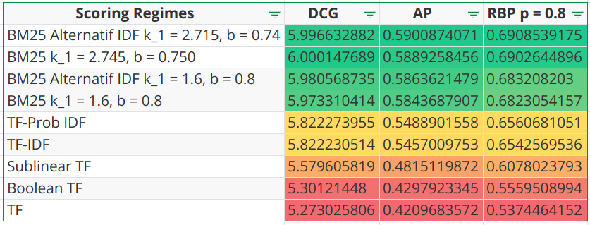

## Eksperimen Tugas 2

Hocky Yudhiono
1906285604

---

Pertama-tama akan dipersiapkan beberapa variant dari penghitungan *score*.  Definisikan fungsi $tf(t, D)$ sebagai term frequency untuk suatu term $t$ pada dokumen $D$. Definisikan pula fungsi $DF(t)$ yaitu frekuensi dokumen yang memiliki term $t$. Definisikan $N$ sebagai banyaknya dokumen yang ada dalam data set. Definisikan pula score $w(t, D)$ yang merupakan kontribusi skor suatu term terhadap suatu dokumen $D$. Perhatikan bahwa terdapat juga komponen $w(t, Q)$ pada sebagian variasi yang didefinisikan sebagai kontribusi skor term $t$ terhadap suatu Query $Q$ secara umum. Skor akhir merupakan $\sum_{t\in Q} w(t, D) \times w(t, Q)$. Asumsikan di sini $w(t, D)$ dihitung berkontribusi jika dan hanya jika $tf(t, D) > 0$, selain itu maka $w(t, D)$ dianggap bernilai $= 0$. Variasinya antara lain ada:

- TF biasa, dengan $w(t, D) = tf(t, D)$
- TF sublinear, dengan $w(t, D) = 1 + \log(tf(t, D))$
- TF boolean, dengan $w(t, D) = 1$
- TF IDF, dengan $w(t, D) = 1 + \log(tf(t, D))$ dan $w(t, Q) = \log(N/DF(t))$
- TF Prob IDF, dengan $w(t, D) = 1 + \log(tf(t, D))$ dan $w(t, Q) = \max (0, \log(\frac{N - DF(t)}{DF(t)}))$
- BM25 dengan $w(t, D) =  \dfrac{\left(k_1+1\right) \cdot t f_t}{k_1\left((1-b)+b \frac{d l}{a v d l}\right)+t f_t}$ dan bagian IDFnya $w(t, Q) = \log(N/DF(t))$
- BM25 IDF alternatif, dengan $w(t, D) =  \dfrac{\left(k_1+1\right) \cdot t f_t}{k_1\left((1-b)+b \frac{d l}{a v d l}\right)+t f_t}$ dan bagian IDFnya $w(t, Q) = \log \left(\frac{N-d f_t+0.5}{d f_t+0.5}\right)$

Karena pada bagian BM25 terhadap beberapa konstan yang harus dituning, saya melakukan grid search yang dipersempit hingga didapatkan yang optimal (belum dipastikan apakah overfit atau tidak), yaitu dengan $k_1$ sekitar $2.72$ dan $b = 0.75$. Keluaran hasil kode yang dijalankan dari berkas `experiment.py` ialah sebagai berikut:

```
Hasil evaluasi TF terhadap 30 queries
RBP score = 0.5374464151639661
DCG score = 5.273025805865303
AP score  = 0.420968357173497
Hasil evaluasi Boolean TF terhadap 30 queries
RBP score = 0.5559508993698131
DCG score = 5.301214479955937
AP score  = 0.42979233449113946
Hasil evaluasi Sublinear TF terhadap 30 queries
RBP score = 0.6078023793235736
DCG score = 5.579605818596644
AP score  = 0.4815119871636239
Hasil evaluasi TF-IDF terhadap 30 queries
RBP score = 0.6542569536076905
DCG score = 5.822230513866781
AP score  = 0.5457009752647397
Hasil evaluasi TF-Prob IDF terhadap 30 queries
RBP score = 0.6560681050530871
DCG score = 5.822273955421329
AP score  = 0.5488901557864383
Hasil evaluasi BM25, k1 = 1.6, b = 0.8 terhadap 30 queries
RBP score = 0.6823054156674924
DCG score = 5.973310414266942
AP score  = 0.5843687907048688
Hasil evaluasi BM25, k1 = 2.745, b = 0.750 terhadap 30 queries
RBP score = 0.6902644895620809
DCG score = 6.000147689143085
AP score  = 0.5889258455539179
Hasil evaluasi BM25 alternative 2, k1 = 1.6, b = 0.8 terhadap 30 queries
RBP score = 0.6832082029777564
DCG score = 5.980568735307297
AP score  = 0.5863621478547145
Hasil evaluasi BM25 alternative 2, k1 = 2.715, b = 0.74 terhadap 30 queries
RBP score = 0.6908539175151799
DCG score = 5.996632882113131
AP score  = 0.5900874071487164
```

Selain itu, bisa kita buat tabel pula

| Scoring Regimes                             | DCG           | AP             | RBP $p = 0.8$  |
| ------------------------------------------- | ------------- | -------------- | -------------- |
| TF                                          | $5.273025806$ | $0.4209683572$ | $0.5374464152$ |
| Boolean TF                                  | $5.30121448$  | $0.4297923345$ | $0.5559508994$ |
| Sublinear TF                                | $5.579605819$ | $0.4815119872$ | $0.6078023793$ |
| TF-IDF                                      | $5.822230514$ | $0.5457009753$ | $0.6542569536$ |
| TF-Prob IDF                                 | $5.822273955$ | $0.5488901558$ | $0.6560681051$ |
| BM25 $k_1 = 1.6, b = 0.8$                   | $5.973310414$ | $0.5843687907$ | $0.6823054157$ |
| BM25 $k_1 = 2.745, b = 0.750$               | $6.000147689$ | $0.5889258456$ | $0.6902644896$ |
| BM25 Alternatif IDF $k_1 = 1.6, b = 0.8$    | $5.980568735$ | $0.5863621479$ | $0.683208203$  |
| BM25 Alternatif IDF $k_1 = 2.715, b = 0.74$ | $5.996632882$ | $0.5900874071$ | $0.6908539175$ |



Bila diurutkan berdasarkan skornya dari yang tertinggi ke yang terendah, kita mengetahui bahwa:

- IDF berperan penting dalam meningkatkan skor, alasannya ialah karena IDF memberikan konteks kepentingan terms, misalnya stopwords yang katanya lebih pasaran bobotnya akan dinilai lebih rendah dibandingkan kata langka yang lebih spesifik yang kaya akan makna.
- BM25 memberikan saturasi dari term frequencynya ditandai dengan konstanta $k_1$, ditambah lagi dengan normalisasi dari panjang dokumen yang ditandai dengan konstanta $b$ dan menyebabkan berkurangnya bias dari dokumen panjang yang terlalu memberikan pengulangan tanpa menambah informasi.
- Bisa dilakukan tuning pada metode BM25 yang memiliki konstanta, tapi perlu diketahui bahwa ini juga bisa overfit bila tidak ada dataset untuk validasi.